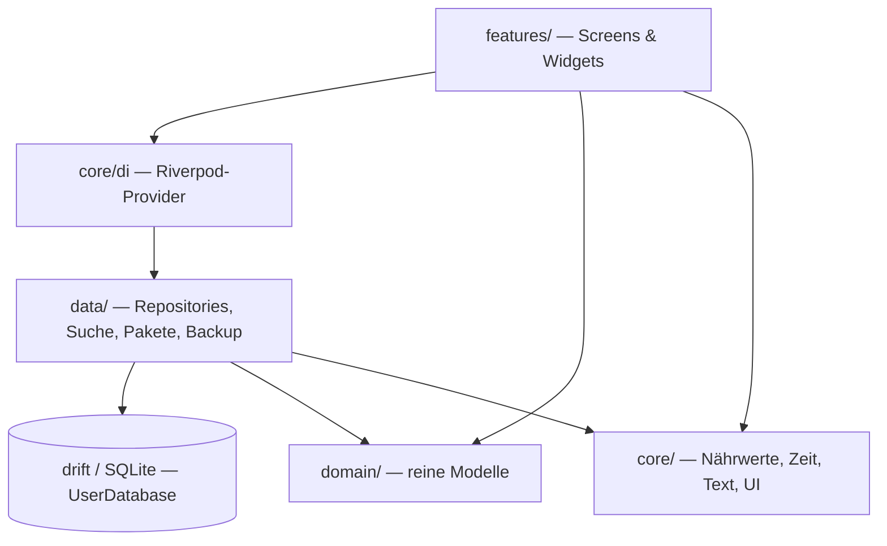
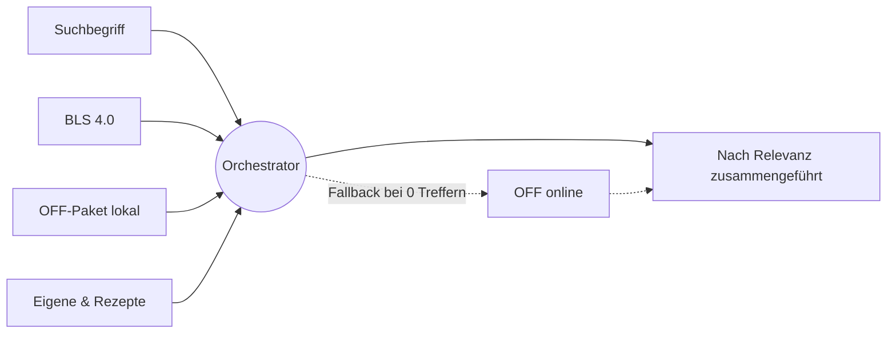

# Architektur

EasyTrack ist eine **Flutter**-App (nur Android) mit **lokal-first** Speicherung. Es gibt
keinen Server; das Datenmodell ist aber **sync-ready** angelegt, sodass sich später ein
Backend ergänzen ließe, ohne die Daten zu migrieren.

## Technik-Stack

| Bereich | Wahl |
|---|---|
| UI / Framework | Flutter, Material 3, eigenes dunkles „Bold"-Theme |
| State-Management | `flutter_riverpod` 3 |
| Datenbank | `drift` + `drift_flutter` (SQLite über native assets aus `package:sqlite3`) |
| Diagramme | `fl_chart` |
| Barcode | `mobile_scanner` |
| Backup / Pakete | `file_selector`, `share_plus`, `archive`, `crypto` |
| Lokalisierung | `flutter_localizations`, `intl`, ARB + `gen-l10n` (Quelle Englisch, Übersetzung Deutsch) |
| Sonstiges | `http`, `path_provider`, `shared_preferences`, `url_launcher`, `uuid` |

!!! note "Kein `sqlite3_flutter_libs`"
    Ab drift 2.32 bringt `package:sqlite3` 3.x SQLite selbst über native assets mit, daher
    ist `sqlite3_flutter_libs` (end-of-life) bewusst **nicht** enthalten.

!!! note "Zweisprachige Oberfläche"
    Die Strings liegen in `lib/l10n/app_en.arb` (Quelle) + `app_de.arb`, generiert per
    `flutter gen-l10n`. `LocaleController` (`core/i18n/`) wechselt die Sprache zur Laufzeit
    und speichert die Wahl in `SharedPreferences`; fehlt sie, folgt die App der Gerätesprache.
    Die generierten `*.g.dart`-Lokalisierungen sind gitignored — CI erzeugt sie vor
    Analyze/Test/Build neu.

## Schichten

Der Code liegt unter `lib/` in vier Schichten:

```
lib/
├── main.dart            App-Einstieg
├── app_boot.dart        ProviderScope + Boot-Swap für den Backup-Import
├── core/                Querschnitt: DI, Nährwert-Typen, Zeit, Text, UI-Bausteine
│   ├── di/              Riverpod-Provider (providers.dart)
│   ├── nutrition/       MeasureUnit (g/ml), FoodRef, MealType, Nährwertmodell
│   ├── time/            Tag-Arithmetik (day_key)
│   ├── text/            deutscher Normalizer (Dart-Seite, spiegelt die ETL)
│   ├── i18n/            LocaleController (Sprachwechsel zur Laufzeit)
│   ├── ids/             UUIDs
│   └── ui/              Theme, Widgets, day_picker (mit „Heute"-Kürzel)
├── data/                Datenzugriff
│   ├── db/              drift-Tabellen + UserDatabase (schemaVersion 4)
│   ├── food/            FoodItem, ServingOption, Such-Provider + Orchestrator
│   ├── pack/            OFF-Produktpaket: Installer, Service, lokaler Provider
│   ├── repositories/    Diary, Weight, PinnedFoods, History …
│   └── backup/          BackupService (Export / Stage / Verify / Apply)
├── domain/              reine Domänenmodelle (History, WeightSeries …)
└── features/            Feature-first-Screens (siehe unten)
```



Die **`features/`**-Ordner sind pro Funktion geschnitten: `diary`, `search`, `scan`,
`recipes`, `goals`, `history`, `weight`, `profile`, `settings`, `onboarding`, `splash`,
`shell`, `activity`, `backup`. Jedes Feature besitzt seine Screens/Widgets und greift über
Riverpod-Provider auf `data/` zu.

## Leitprinzipien

- **Lokal-first.** Es gibt keine Anmeldung. Die einzige Datenkopie ist die SQLite-Datei;
  Portabilität liefert der [Backup](../nutzer/datensicherung.md)-Export.
- **Sync-ready.** Jede synchronisierbare Tabelle trägt Sync-Metadaten und
  Soft-Delete-Tombstones (siehe [Datenmodell](datenmodell.md)).
- **Snapshot-Logging.** Geloggte Tagebucheinträge speichern eine Nährwert-Momentaufnahme,
  damit spätere Änderungen an einem Lebensmittel die Historie nicht rückwirkend verändern.
- **Offline-first-Suche.** Ein Orchestrator führt mehrere Quellen (BLS, OFF-Paket, eigene
  Einträge, Online-Fallback) nach Relevanz zusammen; die Online-Quelle blockiert nie den
  lokalen Pfad.


