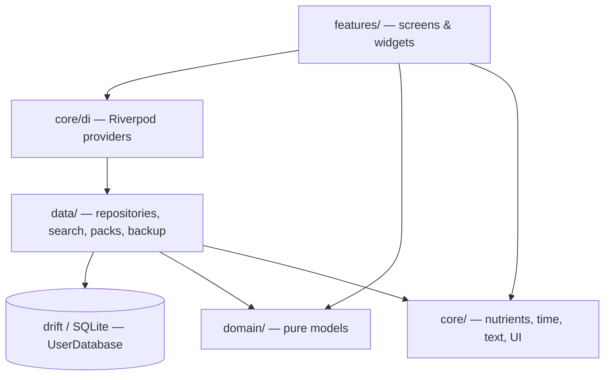
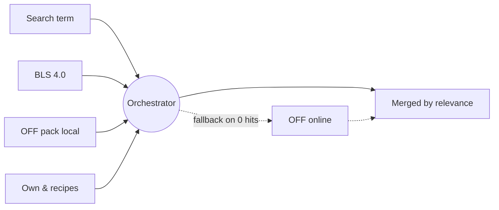

# Architecture

EasyTrack is a **Flutter** app (Android-only) with **local-first** storage. There is no
server; the data model is, however, **sync-ready**, so a backend could be added later
without migrating the data.

## Tech stack

| Area | Choice |
|---|---|
| UI / framework | Flutter, Material 3, custom dark "Bold" theme |
| State management | `flutter_riverpod` 3 |
| Database | `drift` + `drift_flutter` (SQLite via native assets from `package:sqlite3`) |
| Charts | `fl_chart` |
| Barcode | `mobile_scanner` |
| Backup / packs | `file_selector`, `share_plus`, `archive`, `crypto` |
| Localization | `flutter_localizations`, `intl`, ARB + `gen-l10n` (English source, German translation) |
| Other | `http`, `path_provider`, `shared_preferences`, `url_launcher`, `uuid` |

!!! note "No `sqlite3_flutter_libs`"
    From drift 2.32 on, `package:sqlite3` 3.x ships SQLite itself via native assets, so
    `sqlite3_flutter_libs` (end-of-life) is deliberately **absent**.

!!! note "Bilingual UI"
    Strings live in `lib/l10n/app_en.arb` (source) + `app_de.arb`, generated via
    `flutter gen-l10n`. `LocaleController` (`core/i18n/`) switches language at runtime and
    persists the choice in `SharedPreferences`; absent means "follow the device language".
    The generated `*.g.dart` localizations are gitignored — CI regenerates them before
    analyze/test/build.

## Layers

The code lives under `lib/` in four layers:

```
lib/
├── main.dart            app entry
├── app_boot.dart        ProviderScope + boot-swap for the backup import
├── core/                cross-cutting: DI, nutrient types, time, text, UI parts
│   ├── di/              Riverpod providers (providers.dart)
│   ├── nutrition/       MeasureUnit (g/ml), FoodRef, MealType, nutrient model
│   ├── time/            day arithmetic (day_key)
│   ├── text/            German normalizer (Dart side, mirrors the ETL)
│   ├── i18n/            LocaleController (runtime language switch)
│   ├── ids/             UUIDs
│   └── ui/              theme, widgets, day_picker (with a "Heute"/today shortcut)
├── data/                data access
│   ├── db/              drift tables + UserDatabase (schemaVersion 4)
│   ├── food/            FoodItem, ServingOption, search providers + orchestrator
│   ├── pack/            OFF product pack: installer, service, local provider
│   ├── repositories/    diary, weight, pinned foods, history …
│   └── backup/          BackupService (export / stage / verify / apply)
├── domain/              pure domain models (History, WeightSeries …)
└── features/            feature-first screens (see below)
```



The **`features/`** folders are cut per function: `diary`, `search`, `scan`, `recipes`,
`goals`, `history`, `weight`, `profile`, `settings`, `onboarding`, `splash`, `shell`,
`activity`, `backup`. Each feature holds its screens/widgets and reaches `data/` through
Riverpod providers.

## Guiding principles

- **Local-first.** There is no sign-in. The only copy of the data is the SQLite file;
  portability comes from the [backup](../nutzer/datensicherung.md) export.
- **Sync-ready.** Every syncable table carries sync metadata and soft-delete tombstones
  (see [Data model](datenmodell.md)).
- **Snapshot logging.** Logged diary entries store a nutrient snapshot, so later edits to a
  food don't retroactively change history.
- **Offline-first search.** An orchestrator merges several sources (BLS, OFF pack, own
  entries, online fallback) by relevance; the online source never blocks the local path.


