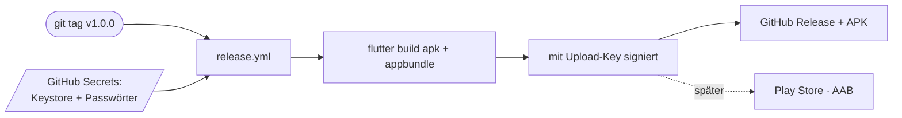

# Build & Release

## Voraussetzungen

- **Flutter 3.44.1** (stable) — dieselbe Version, gegen die CI pinnt.
- **Android SDK** (minSdk 21) und **JDK 17**.
- **Node ≥ 20** für die [Lebensmittel-ETL](food-daten.md).

Toolchain-Eckdaten dieses Projekts: Gradle 9.1, AGP 9.0.1, Kotlin 2.3.20.

## Entwickeln

```bash
flutter pub get
dart run build_runner build --delete-conflicting-outputs   # drift-Codegen
flutter analyze
flutter test
flutter run -d windows          # schnellste Iteration
flutter run -d <android-device> # nötig für Kamera, Speicher, Paket-Download
```

Die drift-Tabellen erzeugen generierten Code (`*.g.dart`, `*.drift.dart`) via
`build_runner`; nach Schema-Änderungen neu generieren.

!!! warning "APK-Build separat prüfen"
    `flutter analyze` und `flutter test` können **grün** sein, während der **APK-Build**
    an einem nativen/Kotlin-Gradle-Plugin-Konflikt scheitert. Deshalb baut CI zusätzlich
    ein Debug-APK:
    ```bash
    flutter build apk --debug
    ```
    (Historie: `file_picker` ließ sich hier nicht bauen; genutzt wird stattdessen
    `file_selector`.)

## App-Icon

Der Launcher-Mark (Limettenring auf dunkelgrünem Feld) wird aus Code erzeugt:

```bash
dart run tool/gen_icon.dart          # zeichnet assets/icon/*.png
dart run flutter_launcher_icons      # erzeugt die Android-Ressourcen
```

`flutter_launcher_icons` hat `ios: false` — das ist ein reiner Android-Build ohne
`ios/`-Verzeichnis.

## Continuous Integration

`.github/workflows/ci.yml` läuft bei Push auf `master` und bei jedem PR:

- **flutter** — `flutter pub get`, `analyze`, `test`, `build apk --debug`.
- **etl** — `npm ci` + `npm test` aus `tools/etl`.

Alles auf Flutter 3.44.1 / JDK 17 / Node 20 gepinnt.

## Release

`.github/workflows/release.yml` löst bei einem **`v*`-Tag** aus, baut ein **signiertes
APK + AAB** und veröffentlicht ein GitHub Release mit dem APK.



```bash
git tag v1.0.0
git push origin v1.0.0
```

Die `versionCode` kommt aus `github.run_number` und steigt so monoton.

### Signierung — wie es funktioniert

Android identifiziert Updates über die **Signatur**: Ein Update installiert nur über eine
bestehende App, wenn es mit **demselben Schlüssel** signiert ist — sonst muss der Nutzer
deinstallieren und verliert (bei einer lokal-first App) alle Daten. Der Release-Schlüssel
muss also **stabil und geheim** bleiben.

**Upload-Keystore erzeugen (einmalig, gut sichern!):**

```bash
keytool -genkeypair -v -keystore easytrack-upload.jks \
  -alias easytrack -keyalg RSA -keysize 4096 -validity 10000
```

**In CI hinterlegen** — Keystore base64-kodieren und als GitHub-Secrets ablegen:

| Secret | Inhalt |
|---|---|
| `ANDROID_KEYSTORE_BASE64` | base64 des `.jks` |
| `ANDROID_KEYSTORE_PASSWORD` | Store-Passwort |
| `ANDROID_KEY_ALIAS` | `easytrack` |
| `ANDROID_KEY_PASSWORD` | Key-Passwort |

`release.yml` dekodiert den Keystore, schreibt `android/key.properties` und lässt Gradle
signieren. `android/app/build.gradle.kts` liest `key.properties`, wenn vorhanden, und fällt
sonst auf den Debug-Schlüssel zurück — so baut lokales `flutter run --release` auch ohne
Keystore. `key.properties` und `*.jks` sind gitignored.

!!! info "Play Store später"
    Play erwartet ein **AAB** und re-signiert es mit dem **Play-App-Signing-Key**. Wer
    Sideload- und Play-Installationen update-kompatibel halten will, lädt beim ersten
    Anlegen der Play-App den **eigenen Keystore als App-Signing-Key** hoch (statt Google
    einen generieren zu lassen) und behält dieselbe `applicationId` (`is.dnn.easytrack`).
    Der erste Release muss dabei manuell über die Play Console hochgeladen werden.
