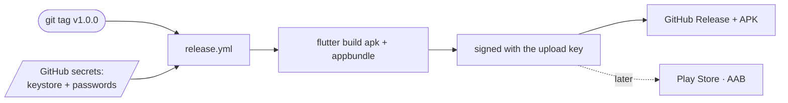

# Build & Release

## Requirements

- **Flutter 3.44.1** (stable) — the same version CI pins to.
- **Android SDK** (minSdk 21) and **JDK 17**.
- **Node ≥ 20** for the [food ETL](food-daten.md).

This project's toolchain: Gradle 9.1, AGP 9.0.1, Kotlin 2.3.20.

## Developing

```bash
flutter pub get
dart run build_runner build --delete-conflicting-outputs   # drift codegen
flutter analyze
flutter test
flutter run -d windows          # fastest iteration
flutter run -d <android-device> # needed for camera, storage, pack download
```

The drift tables produce generated code (`*.g.dart`, `*.drift.dart`) via `build_runner`;
regenerate after schema changes.

!!! warning "Check the APK build separately"
    `flutter analyze` and `flutter test` can be **green** while the **APK build** fails on a
    native / Kotlin-Gradle-Plugin clash. That's why CI also builds a debug APK:
    ```bash
    flutter build apk --debug
    ```
    (History: `file_picker` wouldn't build here; `file_selector` is used instead.)

## App icon

The launcher mark (lime ring on a deep-green field) is generated from code:

```bash
dart run tool/gen_icon.dart          # draws assets/icon/*.png
dart run flutter_launcher_icons      # generates the Android resources
```

`flutter_launcher_icons` has `ios: false` — this is an Android-only build with no `ios/`
directory.

## Continuous Integration

`.github/workflows/ci.yml` runs on pushes to `master` and on every PR:

- **flutter** — `flutter pub get`, `analyze`, `test`, `build apk --debug`.
- **etl** — `npm ci` + `npm test` from `tools/etl`.

All pinned to Flutter 3.44.1 / JDK 17 / Node 20.

## Release

`.github/workflows/release.yml` triggers on a **`v*` tag**, builds a **signed APK + AAB** and
publishes a GitHub Release with the APK.

```bash
git tag v1.0.0
git push origin v1.0.0
```



The `versionCode` comes from `github.run_number` and thus increases monotonically.

### Signing — how it works

Android identifies updates by their **signature**: an update only installs over an existing
app if it's signed with the **same key** — otherwise the user must uninstall and (for a
local-first app) loses all data. So the release key must stay **stable and secret**.

**Create the upload keystore (once, keep it safe!):**

```bash
keytool -genkeypair -v -keystore easytrack-upload.jks \
  -alias easytrack -keyalg RSA -keysize 4096 -validity 10000
```

**Store it in CI** — base64-encode the keystore and add GitHub secrets:

| Secret | Contents |
|---|---|
| `ANDROID_KEYSTORE_BASE64` | base64 of the `.jks` |
| `ANDROID_KEYSTORE_PASSWORD` | store password |
| `ANDROID_KEY_ALIAS` | `easytrack` |
| `ANDROID_KEY_PASSWORD` | key password |

`release.yml` decodes the keystore, writes `android/key.properties` and lets Gradle sign.
`android/app/build.gradle.kts` reads `key.properties` when present and otherwise falls back to
the debug key — so a local `flutter run --release` builds without a keystore too.
`key.properties` and `*.jks` are gitignored.

!!! info "Play Store later"
    Play expects an **AAB** and re-signs it with the **Play app-signing key**. To keep
    sideload and Play installs update-compatible, upload **your own keystore as the app-signing
    key** when first creating the Play app (instead of letting Google generate one) and keep
    the same `applicationId` (`is.dnn.easytrack`). The first release must be uploaded manually
    through the Play Console.
