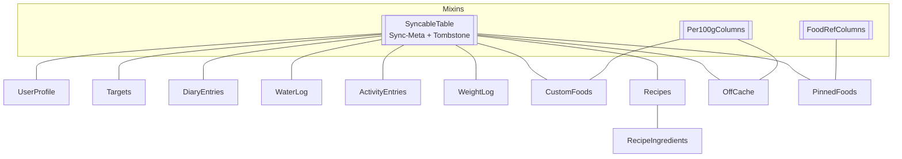

# Datenmodell

Die Nutzerdatenbank ist eine lokale **drift/SQLite**-Datenbank, definiert in
`lib/data/db/tables.dart` und `lib/data/db/user_database.dart`
(`@DriftDatabase`, aktuelle **`schemaVersion` = 4**).

## Tabellen

| Tabelle | Zweck |
|---|---|
| `UserProfile` | Körperdaten (Geschlecht, Alter, Größe, Gewicht, Aktivität) |
| `Targets` | Zielhistorie: Kalorien-/Makro-/Wasserziele mit Gültigkeitsbeginn |
| `DiaryEntries` | Geloggte Mahlzeiten-Einträge (mit Nährwert-Snapshot) |
| `WaterLog` | Wasserprotokoll pro Tag |
| `ActivityEntries` | Manuelle Aktivitäts-/Kalorienverbrauch-Einträge |
| `WeightLog` | Ein Gewichtseintrag pro Tag (Upsert) |
| `CustomFoods` | Eigene Lebensmittel (Nährwerte pro 100 g/ml) |
| `Recipes` + `RecipeIngredients` | Rezepte und ihre gewogenen Zutaten |
| `OffCache` | Zwischengespeicherte Open-Food-Facts-Online-Treffer |
| `PinnedFoods` | Quellenübergreifende Favoriten (Referenz + Name) |
| `SyncCursors` | Buchhaltung für eine spätere Synchronisierung |

## Gemeinsame Spalten (Mixins)

- **`SyncableTable`** — Sync-Metadaten und Soft-Delete: Einträge werden nicht hart
  gelöscht, sondern als **Tombstone** markiert, damit eine spätere Synchronisierung
  Löschungen propagieren kann. Trigger und Kaskaden dazu sind in
  `test/data/user_database_test.dart` abgedeckt.
- **`Per100gColumns`** — Nährwerte pro 100 g/ml (genutzt von `CustomFoods`, `OffCache`).
- **`FoodRefColumns`** — quellenübergreifende Lebensmittel-Referenz (genutzt von
  `PinnedFoods`).

## Wichtige Konventionen

- **Mahlzeiten-Namen (wire):** `breakfast`, `lunch`, `dinner`, **`snacks`** — der letzte
  hat ein „s". `MealType.fromWire` (in `core/nutrition/food_ref.dart`) wirft bei einem
  unbekannten Wert; der `DiaryRepository.watchDay`-Combiner fängt das ab und leitet es in
  den Fehlerkanal des Streams, statt zu hängen (Regressionstest → „resilience").
- **Maßeinheit:** Lebensmittel tragen eine `MeasureUnit` (g/ml). Getränke werden in **ml**
  geführt (1 ml ≈ 1 g fürs Nährwert-Skalieren, daher hält `amountG` weiter die Zahl). Die
  Einheit ist als Snapshot in `diary_entries` gespeichert, sodass ein geloggtes Getränk in
  ml bleibt.
- **Snapshot-Logging:** `DiaryEntries` speichert die Nährwerte zum Log-Zeitpunkt, nicht nur
  eine Referenz — die Historie ist gegen spätere Bearbeitungen eines Lebensmittels immun.

## Migrationen

Die Migrationen sind bewusst **additiv**: `addColumn` auf **nullbaren** Spalten, also
nicht-destruktiv. Kein App-Code löscht `user.sqlite` (die einzigen `.delete()`-Aufrufe
betreffen OFF-Paket-Temporärdateien). Auf Android liegt die Datei unter
`app_flutter/user.sqlite` (Documents-Verzeichnis von `drift_flutter`).

!!! warning "„Daten weg nach Rebuild""
    Das ist fast immer eine **Neuinstallation** (uninstall + install löscht App-Daten),
    kein Migrationsfehler. `flutter run` / IDE-Run macht `install -r` und **erhält** die
    Daten. Details in den Entwickler-Notizen des App-Repos.
