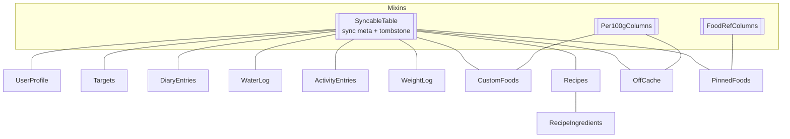

# Data model

The user database is a local **drift/SQLite** database, defined in `lib/data/db/tables.dart`
and `lib/data/db/user_database.dart` (`@DriftDatabase`, current **`schemaVersion` = 4**).

## Tables

| Table | Purpose |
|---|---|
| `UserProfile` | Body data (sex, age, height, weight, activity) |
| `Targets` | Target history: calorie/macro/water goals with a validity start |
| `DiaryEntries` | Logged meal entries (with a nutrient snapshot) |
| `WaterLog` | Water log per day |
| `ActivityEntries` | Manual activity / calorie-burn entries |
| `WeightLog` | One weight entry per day (upsert) |
| `CustomFoods` | Custom foods (nutrients per 100 g/ml) |
| `Recipes` + `RecipeIngredients` | Recipes and their weighed ingredients |
| `OffCache` | Cached Open Food Facts online hits |
| `PinnedFoods` | Cross-source favourites (reference + name) |
| `SyncCursors` | Bookkeeping for a future sync |

## Shared columns (mixins)

- **`SyncableTable`** — sync metadata and soft-delete: entries aren't hard-deleted but marked
  as a **tombstone**, so a future sync can propagate deletions. The related triggers and
  cascades are covered in `test/data/user_database_test.dart`.
- **`Per100gColumns`** — nutrients per 100 g/ml (used by `CustomFoods`, `OffCache`).
- **`FoodRefColumns`** — cross-source food reference (used by `PinnedFoods`).

## Important conventions

- **Meal names (wire):** `breakfast`, `lunch`, `dinner`, **`snacks`** — the last one has an
  "s". `MealType.fromWire` (in `core/nutrition/food_ref.dart`) throws on an unknown value;
  the `DiaryRepository.watchDay` combiner catches that and routes it to the stream's error
  channel instead of hanging (regression test → "resilience").
- **Measure unit:** foods carry a `MeasureUnit` (g/ml). Drinks are tracked in **ml** (1 ml ≈
  1 g for nutrient scaling, so `amountG` still holds the number). The unit is snapshotted in
  `diary_entries`, so a logged drink stays in ml.
- **Snapshot logging:** `DiaryEntries` stores the nutrients at log time, not just a
  reference — history is immune to later edits of a food.

## Migrations

Migrations are deliberately **additive**: `addColumn` on **nullable** columns, i.e.
non-destructive. No app code deletes `user.sqlite` (the only `.delete()` calls concern OFF
pack temp files). On Android the file lives at `app_flutter/user.sqlite` (`drift_flutter`'s
documents directory).

!!! warning ""Data gone after a rebuild""
    That's almost always a **reinstall** (uninstall + install wipes app data), not a
    migration bug. `flutter run` / IDE Run does `install -r` and **preserves** the data.
    Details in the app repo's developer notes.
