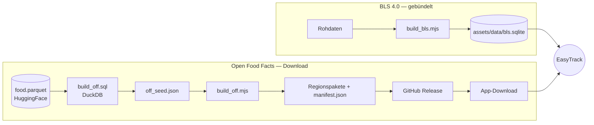

# Lebensmitteldaten & ETL

Die offline durchsuchbaren Lebensmitteldaten werden von Node-Skripten unter
**`tools/etl/`** erzeugt. Sie schreiben SQLite-Pakete, die die App zur Laufzeit liest.



!!! danger "Immer aus `tools/etl` ausführen"
    Node's Test-Runner löst `node --test .` **relativ zum Arbeitsverzeichnis** auf. Vom
    Repo-Root aus findet `npm test` **null Tests** und meldet fälschlich Erfolg. Immer
    `cd tools/etl` zuerst. Node ≥ 20.

## BLS 4.0 (mitgeliefert)

- **`build_bls.mjs`** erzeugt `assets/data/bls.sqlite` — die generische deutsche
  Datenbank (rund **7.140** Zeilen), fest in die App gebündelt.
- Die Suche nutzt SQLite-**FTS**; Integrität und Zeilenzahl sind in
  `test/data/reference_database_test.dart` gegen das echte Paket getestet.

## Deutscher Normalizer (geteilt)

`normalize.mjs` normalisiert Suchbegriffe (Umlaute, Morpheme, …). Die **Dart-Seite**
(`lib/core/text/`) spiegelt dieselbe Logik, geprüft gegen **eine gemeinsame Fixture**
(`normalize.test.mjs` + `test/core/german_normalizer_test.dart`), damit Index und Abfrage
identisch normalisieren.

## Open Food Facts (Produktpaket)

- **`build_off.sql`** — die Produktions-Abfrage (DuckDB) gegen das echte HuggingFace
  `food.parquet` (vorher ein `DESCRIBE` — die `product_name`/`nutriments`-Strukturen sind
  verschachtelt).
- **`build_off.mjs`** — der Writer, der aus `off_seed.json` die Regionspakete baut
  (Sanity-Filter, FTS, ODbL-Metadaten). Getestet in `build_off.test.mjs`.

### Die Live-Pipeline

Seit **v1.0.0** werden die Pakete automatisch gebaut und veröffentlicht. Eine
containerisierte Pipeline führt `build_off.sql` → `build_off.mjs` aus und veröffentlicht die
Regionspakete + `manifest.json` in ein rollendes **`off-latest`** GitHub Release. Die
Manifest-URL der App ist **fest eingebaut** (Default in `PackService`, überschreibbar mit
`--dart-define=OFF_MANIFEST_URL=…`), sodass der In-App-Download ohne Weiteres funktioniert.

Der In-App-Installer (`data/pack/`) lädt, prüft per **SHA-256** + `integrity_check` und
tauscht das Paket **atomar** ein; ein Fehler lässt das installierte Paket unangetastet.
Bislang ist nur das **`de`**-Paket live; `dach` und `world` entstehen durch erneuten Lauf der
Pipeline mit den zusätzlichen Regionen.

## Tests

```bash
cd tools/etl
npm ci
npm test        # ETLs + Normalizer
```

Diese Suite läuft auch in CI (`ci.yml`, Job **etl**).
