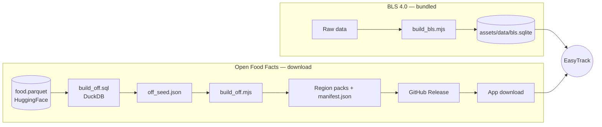

# Food data & ETL

The offline-searchable food data is produced by Node scripts under **`tools/etl/`**. They
write SQLite packs that the app reads at runtime.



!!! danger "Always run from `tools/etl`"
    Node's test runner resolves `node --test .` **relative to the working directory**. From
    the repo root, `npm test` finds **zero tests** and falsely reports success. Always
    `cd tools/etl` first. Node ≥ 20.

## BLS 4.0 (bundled)

- **`build_bls.mjs`** produces `assets/data/bls.sqlite` — the generic German database (around
  **7,140** rows), bundled into the app.
- Search uses SQLite **FTS**; integrity and row count are tested against the real pack in
  `test/data/reference_database_test.dart`.

## German normalizer (shared)

`normalize.mjs` normalizes search terms (umlauts, morphemes, …). The **Dart side**
(`lib/core/text/`) mirrors the same logic, checked against **one shared fixture**
(`normalize.test.mjs` + `test/core/german_normalizer_test.dart`), so index and query
normalize identically.

## Open Food Facts (product pack)

- **`build_off.sql`** — the production query (DuckDB) against the real HuggingFace
  `food.parquet` (`DESCRIBE` first — the `product_name`/`nutriments` structs are nested).
- **`build_off.mjs`** — the writer that builds the region packs from `off_seed.json` (sanity
  filter, FTS, ODbL metadata). Tested in `build_off.test.mjs`.

### The live pipeline

Since **v1.0.0** the packs are built and published automatically. A containerized pipeline
runs `build_off.sql` → `build_off.mjs`, then publishes the region packs + `manifest.json` to a
rolling **`off-latest`** GitHub Release. The app's manifest URL is **baked in** (the default in
`PackService`, overridable with `--dart-define=OFF_MANIFEST_URL=…`), so the in-app download
works out of the box.

```
Release: off-latest
  ├── manifest.json     # regions, versions, sizes, SHA-256
  ├── off-de.sqlite     # published
  ├── off-dach.sqlite   # planned
  └── off-world.sqlite  # planned
```

The in-app installer (`data/pack/`) downloads, verifies via **SHA-256** + `integrity_check`,
and swaps the pack in **atomically**; a failure leaves the installed pack untouched. Only the
**`de`** pack is live so far; `dach` and `world` are built by re-running the pipeline with the
extra regions.

## Tests

```bash
cd tools/etl
npm ci
npm test        # ETLs + normalizer
```

This suite also runs in CI (`ci.yml`, the **etl** job).
