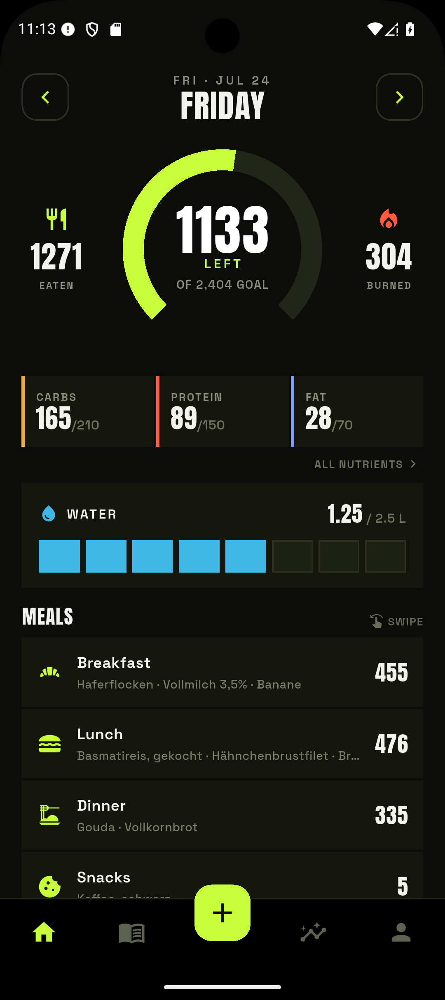
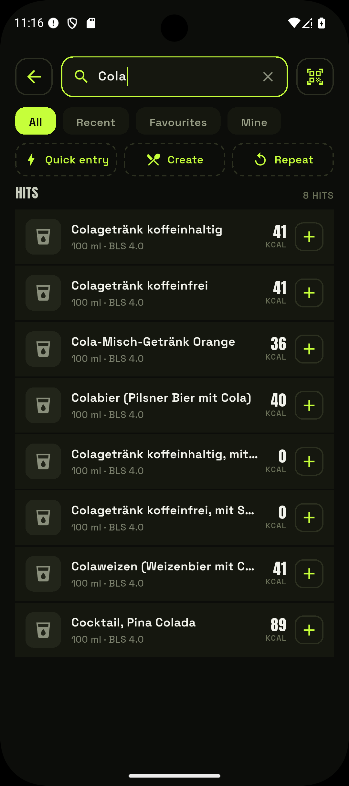

# EasyTrack

**EasyTrack** is a personal, local-first calorie and hydration tracker for Android — with an
offline German food database, barcode scanning, recipes, and no account, no subscription,
no cloud.

All data stays on the device. There's no sign-in, no tracking, and no server reading along.

!!! note "Available in English and German"
    EasyTrack speaks both languages. By default it follows your phone's language; you can
    also pick one explicitly under **Settings → Language**. This guide uses the app's English
    labels — use the language switcher (top right) for the German ones.

<figure markdown="span">
  
  <figcaption>Diary — calorie ring & macros</figcaption>
</figure>
<figure markdown="span">
  
  <figcaption>Offline search & barcode</figcaption>
</figure>
<figure markdown="span">
  
  <figcaption>History & weight trend</figcaption>
</figure>

- :material-cellphone-arrow-down: **[Installation](nutzer/installation.md)**
  Download the APK, allow sideloading, update.

- :material-flag-checkered: **[Getting Started](nutzer/erste-schritte.md)**
  Onboarding, body data, daily goal.

- :material-book-open-variant: **[Diary & Water](nutzer/tagebuch.md)**
  Meals, macros, water and activity.

- :material-barcode-scan: **[Search & Barcode](nutzer/suche-barcode.md)**
  Offline search, barcode scan, custom foods.

- :material-chart-line: **[Goals & TDEE](nutzer/ziele.md)**
  Mifflin-St Jeor calculation, always overridable.

- :material-database-lock: **[Privacy](nutzer/datenschutz.md)**
  What's stored — and what isn't.

## For developers

The source lives under the **GPL-3.0** at
[github.com/windowsaft/easytrack](https://github.com/windowsaft/easytrack). Start with
architecture, data model and build in the **[Developers section](entwickler/architektur.md)**.

## Data sources

- **Bundeslebensmittelschlüssel (BLS) 4.0** — generic German foods, licensed under
  [CC BY 4.0](https://creativecommons.org/licenses/by/4.0/deed.de).
- **[Open Food Facts](https://openfoodfacts.org)** — branded and barcode products, under the
  [ODbL 1.0](https://opendatacommons.org/licenses/odbl/1-0/).

The bundled food data is **not** covered by the GPL; it keeps its own licenses. See
[Privacy](nutzer/datenschutz.md) and [Contributing](entwickler/beitragen.md).
