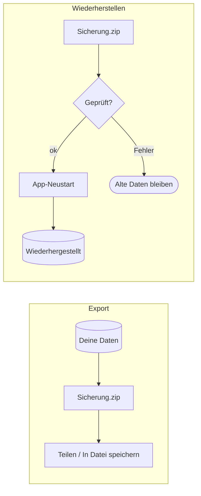

# Datensicherung

Weil EasyTrack **lokal-first** ist und kein Konto kennt, liegt die einzige Kopie deiner
Daten in der App auf dem Telefon. Die **Datensicherung** gibt dir eine portable Kopie, die
dir gehört: die gesamte Datenbank als Zip-Datei — zum Wiederherstellen nach einer
Neuinstallation oder auf einem neuen Gerät.

Erreichbar über **Einstellungen → Daten sichern / Daten wiederherstellen** (beide
Richtungen) und aus dem **Onboarding-Willkommensschritt** (nur Wiederherstellen — auf einer
frischen Installation gibt es noch nichts zu exportieren).

## Was gesichert wird

Eine Zip-Datei mit genau zwei Einträgen:

| Eintrag | Inhalt |
|---|---|
| `user.sqlite` | Die komplette Nutzerdatenbank (ein sauberer, kompaktierter Schnappschuss) |
| `backup.json` | Ein Manifest mit App-Build, Schema-Version und Erstellungszeit |

Es wird die **rohe Datenbank** gesichert (nicht Tabelle für Tabelle als JSON) — so bleiben
alle Zeilen, ihre Sync-Metadaten und Löschmarkierungen erhalten, und künftige Tabellen sind
automatisch mit abgedeckt.

## Exportieren

Der Export baut die Zip-Datei und übergibt sie an das **System-Teilen-Menü**. Auf Android
erscheint dort **„In Datei speichern"** (Dateien-App) neben den üblichen Zielen — das ist
der Weg, sie in einen Ordner oder Cloud-Speicher deiner Wahl zu legen.

!!! tip "Vor jedem Gerätewechsel exportieren"
    Ein Deinstallieren löscht alle App-Daten. Exportiere eine Sicherung, bevor du das
    Gerät wechselst, das Telefon zurücksetzt oder die App entfernst.

## Wiederherstellen

Eine Sicherungs-Zip auswählen. EasyTrack prüft sie zunächst (richtiges Format, Schema nicht
neuer als die installierte App, Integritätsprüfung) und stellt sie dann bereit. Es zeigt den
Inhalt der Sicherung und warnt, dass alle aktuellen Daten ersetzt werden; bei **Ersetzen &
neu starten** startet die App sich selbst neu und tauscht die Datenbank aus — deine alten
Daten werden erst in diesem Moment ersetzt.

!!! warning "Kompatibilität"
    Eine Sicherung aus einer **neueren** App-Version lässt sich nicht in eine ältere App
    zurückspielen. Aktualisiere in dem Fall zuerst die App.
