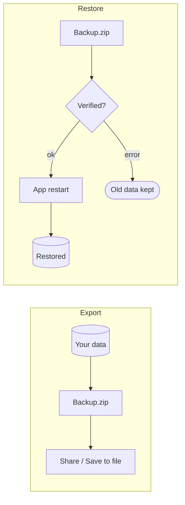

# Backup

Because EasyTrack is **local-first** with no account, the only copy of your data lives in the
app on your phone. The **backup** gives you a portable copy you own: the whole database as a
zip file — to restore after a reinstall or on a new device.

Reachable via **Settings → Back up data / Restore data** (both directions) and from the
**onboarding welcome step** (restore only — there's nothing to export on a fresh install).

## What a backup is

A zip file with exactly two entries:

| Entry | Contents |
|---|---|
| `user.sqlite` | The whole user database (a clean, compacted snapshot) |
| `backup.json` | A manifest with app build, schema version and creation time |

The **raw database** is backed up (not table-by-table as JSON) — so every row, its sync
metadata and its delete markers stay intact, and any future table is covered automatically.

## Export

The export builds the zip and hands it to the **system share sheet**. On Android that lists
**Save to file** (the Files app) alongside the usual targets — that's the way to place it into
a folder or cloud storage of your choice.

!!! tip "Export before every device change"
    Uninstalling deletes all app data. Export a backup before you switch devices, reset the
    phone, or remove the app.

## Restore

Pick a backup zip. EasyTrack first verifies it (correct format, schema not newer than the
installed app, integrity check) and then stages it. It shows what the backup contains and
warns that all current data will be replaced; on **Replace & restart** the app restarts
itself and swaps the database — your old data is only replaced at that moment.

!!! warning "Compatibility"
    A backup from a **newer** app version can't be restored into an older app. Update the app
    first in that case.
