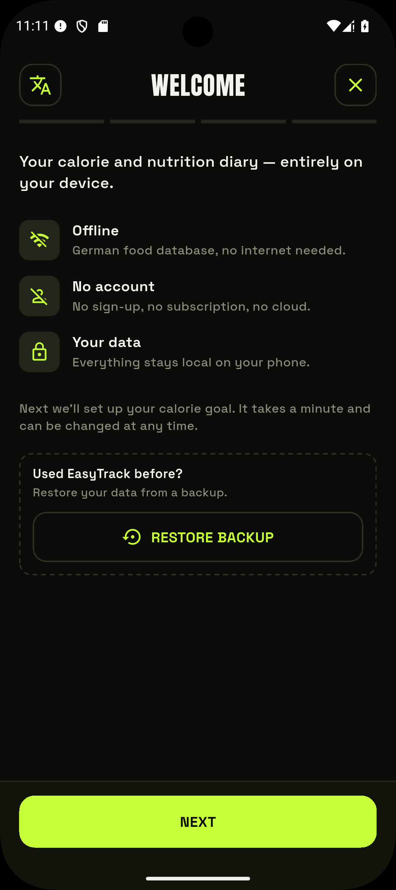

# Getting Started

On first launch a short, skippable **onboarding** walks you through setup. Afterwards the
app opens straight onto your own target values instead of a placeholder.

## Onboarding

<figure markdown="span">
  { .screenshot }
  <figcaption>The first-run onboarding — offline, no account, with an optional backup restore.</figcaption>
</figure>

The steps, in order:

1. **Welcome** — a brief intro (offline, no account, your data stays local). If you've used
   EasyTrack before, you can **[restore a backup](datensicherung.md)** right here.
2. **Your body** — sex, age, height and weight. These feed the calorie calculation.
3. **Activity** — how active you are day to day. Pick a lower band here; you can log workouts
   individually later, so you don't want to count movement twice.
4. **Your goal** — lose, maintain or gain weight (0.5 kg per week is a healthy pace).
5. **Your plan** — your calculated daily goal, then **Let's go**.

The calculation uses the **Mifflin-St Jeor formula** (see [Goals & TDEE](ziele.md)). You can
skip onboarding — the app then starts with a placeholder goal you adjust later under
[Goals](ziele.md).

!!! info "Shown only once"
    Onboarding appears only on the first launch. Once completed or skipped, it won't show
    again. Your inputs can be changed anytime under **Profile** and **Goals**.

## The home view

After onboarding you land in today's **Diary**. The bottom navigation leads to the main
areas:

- **Diary** — meals, water and activity for the day.
- **Recipes** — build your own recipes and log a portion.
- **History** — calories vs. goal over time, and your weight trend.
- **Profile** — goals, weight, settings, and legal notices.

## Choosing the language

EasyTrack is available in **English and German**. By default it follows your phone's
language. To fix it to one language, open **Profile → Settings → Language** and pick English,
German, or **System default** (follow the phone). See [Settings](einstellungen.md).
