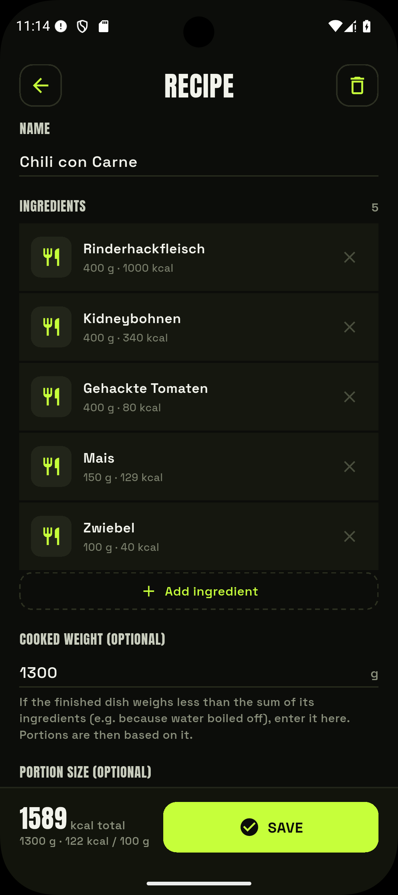

# Rezepte

Mit **Rezepten** baust du ein Gericht einmal aus Zutaten zusammen und loggst danach genau
die Portion, die du wirklich gegessen hast.

<figure markdown="span">
  { .screenshot }
  <figcaption>Ein Rezept aus gewogenen Zutaten mit Chargen-Nährwerten und Portionsangabe.</figcaption>
</figure>

## Ein Rezept anlegen

Im **Rezepte**-Tab über das **+** ein neues Rezept starten:

1. **Zutaten hinzufügen** — jede über dieselbe [Lebensmittelsuche](suche-barcode.md) wie im
   Tagebuch, mit gewogener Menge.
2. EasyTrack summiert die **Gesamtnährwerte** der Charge mit.
3. Optional ein **gekochtes Gewicht** angeben — wiegt das fertige Gericht weniger als die
   Summe der Zutaten (z. B. durch verdampftes Wasser), rechnet EasyTrack die Nährwerte pro
   Gramm entsprechend hoch.
4. Optional eine **Portionsgröße** in Gramm angeben. Die App zeigt dann, wie viele Portionen
   die Charge ergibt und wie viele Kalorien auf eine Portion entfallen.

## Ein Rezept loggen

Ein Rezept verhält sich in der Suche wie jedes andere Lebensmittel (Nährwerte pro 100 g).
Über **Portion loggen** stehen dir im Portions-Fenster zusätzlich zur Verfügung:

- **„1 Portion"** als Standardportion, wenn du eine Portionsgröße hinterlegt hast.
- **„Ganze Menge"** für die komplette Charge.
- Freie Grammangabe wie sonst auch.

So kannst du z. B. ein Chili für den ganzen Topf anlegen und dann tagesweise deine Schüssel
loggen, ohne neu zu rechnen.
