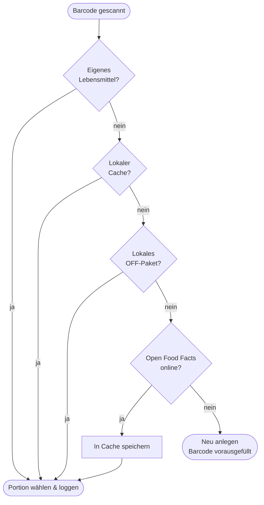

# Suche & Barcode

## Suche

<figure markdown="span">
  { .screenshot }
  <figcaption>Treffer aus BLS 4.0 — Getränke in ml und mit Glas-Symbol. Oben die Filter „Alle / Zuletzt / Favoriten / Meine" sowie „Schnell-Eintrag" und „Anlegen".</figcaption>
</figure>

Die Suche ist **offline-first** und durchsucht mehrere Quellen gleichzeitig:

- **BLS 4.0** — die generische deutsche Lebensmitteldatenbank (rund 7.100 Einträge),
  fest in der App enthalten.
- **Open Food Facts (lokal)** — ein herunterladbares Marken- und Produktpaket
  (siehe [Produktdaten](#produktdaten-open-food-facts) unten).
- **Eigene Lebensmittel** und **Rezepte**.
- **Online-Fallback** — findet die lokale Suche nichts, kann EasyTrack Open Food Facts
  online abfragen und das Ergebnis lokal zwischenspeichern.

Treffer werden nach Relevanz zusammengeführt. Deine eigenen Einträge und Favoriten stehen
weit oben. Die Filter-Tabs — **Alle**, **Zuletzt**, **Favoriten**, **Meine** — grenzen die
Liste ein.

### Portion wählen

Ein Treffer öffnet das **Portions-Fenster**:

- **Portions-Chips** für benannte Portionen (z. B. „Scheibe (25 g)").
- Ein **Mengenfeld** mit ×-Faktor plus **1× / 2× / 3×**-Schnellwahl.
- Live-Anzeige der resultierenden Gramm bzw. **ml** bei Getränken.
- Der **Stern** markiert das Lebensmittel als **Favorit** für schnelles Wiederfinden.

## Barcode-Scanner

Über das **Barcode-Symbol** (in Suche und Mahlzeit) öffnet sich der Kamera-Scanner.
Nach dem Erfassen eines Codes sucht EasyTrack in dieser Reihenfolge:

1. **Eigene Lebensmittel** mit diesem Barcode.
2. **Lokaler Cache** früherer Online-Treffer.
3. **Lokales OFF-Paket**.
4. **Open Food Facts online** (Treffer wird für später zwischengespeichert).
5. Kein Treffer → Angebot, ein **neues Lebensmittel mit vorausgefülltem Barcode** anzulegen.

## Eigene Lebensmittel

Nichts gefunden? Über **Anlegen** ein eigenes Lebensmittel erstellen:

- **Name**, optionale **Marke**, Nährwerte pro 100 g / 100 ml.
- Umschalter **Fest (g) / Getränk (ml)**.
- Optionale **Mikronährstoffe** (Zucker, Ballaststoffe, gesättigte Fette, Salz).
- Optionale **benannte Portion** (Einheit + Gramm).

Deine eigenen Lebensmittel liegen unter dem Tab **Meine**. **Tippe lang** auf eines, um es zu
**bearbeiten oder zu löschen** — bereits geloggte Tagebuch-Einträge bleiben unverändert.

!!! tip "Schnell-Eintrag"
    Für Einmaliges, das du nicht speichern willst — etwa ein Restaurantgericht — gibt es den
    **Schnell-Eintrag**: nur Kalorien und optional die Makros, geloggt ohne ein
    wiederverwendbares Lebensmittel anzulegen.

## Produktdaten (Open Food Facts)

Unter **Profil → Einstellungen → Produktdaten** lässt sich ein **Open-Food-Facts-Paket** für
eine Region herunterladen. Es erweitert die Offline-Suche um Markenprodukte, ohne dass
dafür eine Verbindung nötig ist. Das Paket wird geprüft (SHA-256) und atomar installiert;
schlägt etwas fehl, bleibt das vorhandene Paket unangetastet. Alternativ lässt sich ein Paket
**aus einer lokalen Datei laden**. Siehe [Einstellungen](einstellungen.md).

Open-Food-Facts-Daten stehen unter der [ODbL 1.0](https://opendatacommons.org/licenses/odbl/1-0/);
die Attribution ist in der App unter **Profil → Über** hinterlegt.
