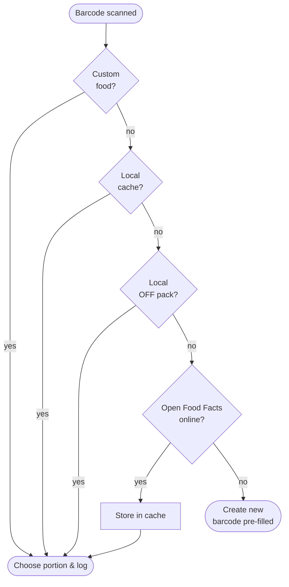

# Search & Barcode

## Search

<figure markdown="span">
  { .screenshot }
  <figcaption>Results from BLS 4.0 — drinks in ml with a glass icon. Top: the All / Recent / Favourites / Mine filters plus Quick entry and Create.</figcaption>
</figure>

Search is **offline-first** and queries several sources at once:

- **BLS 4.0** — the generic German food database (around 7,100 entries), bundled in the app.
- **Open Food Facts (local)** — a downloadable branded-product pack (see
  [Product data](#product-data-open-food-facts) below).
- **Custom foods** and **recipes**.
- **Online fallback** — if local search finds nothing, EasyTrack can query Open Food Facts
  online and cache the result locally.

Hits are merged by relevance. Your own entries and favourites rank high. The filter tabs —
**All**, **Recent**, **Favourites**, **Mine** — narrow the list to what you want.

### Choosing a portion

A hit opens the **portion sheet**:

- **Portion chips** for named servings (e.g. "Slice (25 g)").
- An **amount field** with a × factor plus **1× / 2× / 3×** quick chips.
- A live readout of the resulting grams — or **ml** for drinks.
- The **star** marks the food as a **favourite** for quick recall.

## Barcode scanner

The **barcode icon** (in search and in a meal) opens the camera scanner. After capturing a
code, EasyTrack looks it up in this order:

1. **Custom foods** with this barcode.
2. **Local cache** of earlier online hits.
3. **Local OFF pack**.
4. **Open Food Facts online** (the hit is cached for later).
5. No hit → offer to **create a new food with the barcode pre-filled**.

## Custom foods

Found nothing? Tap **Create** to add your own food:

- **Name**, optional **brand**, nutrients per 100 g / 100 ml.
- A **solid (g) / drink (ml)** toggle.
- Optional **micronutrients** (sugar, fibre, saturated fat, salt).
- An optional **named serving** (unit + grams).

Your custom foods live under the **Mine** tab. **Long-press** one to **edit or delete** it —
diary entries you've already logged from it are kept unchanged.

!!! tip "Quick entry"
    For a one-off you don't want to save — say a restaurant meal — use **Quick entry**: just
    calories, and optionally the macros. It's logged without becoming a reusable food.

## Product data (Open Food Facts)

Under **Profile → Settings → Product data** you can download an **Open Food Facts pack** for a
region. It extends offline search with branded products, with no connection needed. The pack
is verified (SHA-256) and installed atomically; if anything fails, the existing pack is left
untouched. You can also import a pack from a local zip. See [Settings](einstellungen.md).

Open Food Facts data is under the [ODbL 1.0](https://opendatacommons.org/licenses/odbl/1-0/);
the attribution is in the app under **Profile → About**.
