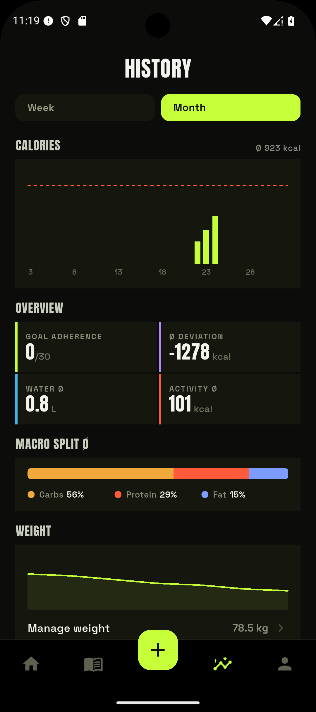
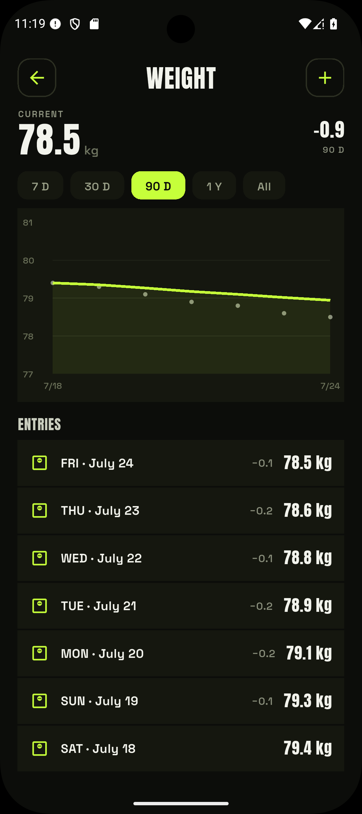

# Verlauf & Gewicht

Der **Verlauf**-Bereich zeigt, wie deine Tage über die Zeit gegen dein Ziel laufen — und
wie sich dein Gewicht entwickelt.

<figure markdown="span">
  { .screenshot }
  <figcaption>Kalorien gegen Ziel je Tag, Überblick-Kacheln, Makro-Split und Gewichtstrend.</figcaption>
</figure>

## Kalorien im Verlauf

Ein Balkendiagramm stellt **Kalorien gegen Ziel** je Tag dar, mit Tageslabels. Darunter
fassen Kacheln den Zeitraum zusammen:

- **Einhaltung / Abweichung** gegenüber dem Ziel.
- **Makro-Aufteilung** über den Zeitraum.

Jeder Tag wird gegen das **damals gültige Ziel** gemessen (siehe [Zielhistorie](ziele.md#zielhistorie)),
nicht gegen deinen aktuellen Wert.

## Gewicht

<figure markdown="span">
  { .screenshot }
  <figcaption>Gewicht eintragen — vorgefüllter letzter Wert mit ±0,1 / ±0,5-Chips, und der Trend.</figcaption>
</figure>

Das Gewicht wird **einmal pro Tag** protokolliert. Über den **Gewichts-Button** im Verlauf
öffnest du das Eingabe-Fenster:

- Es füllt den **letzten Wert** vor und bietet **±0,1 / ±0,5**-Chips für schnelle Korrektur.
- Der Tag wird kompakt angezeigt, z. B. *„FR · 17. Juli"*.

Der **Gewichtstrend** wird als Punktwolke mit geglätteter Linie dargestellt; die Zeiträume
**7 T / 30 T / 90 T / 1 J / Alle** lassen sich umschalten. Angezeigt werden Veränderung,
Minimum/Maximum und der gleitende Durchschnitt.
