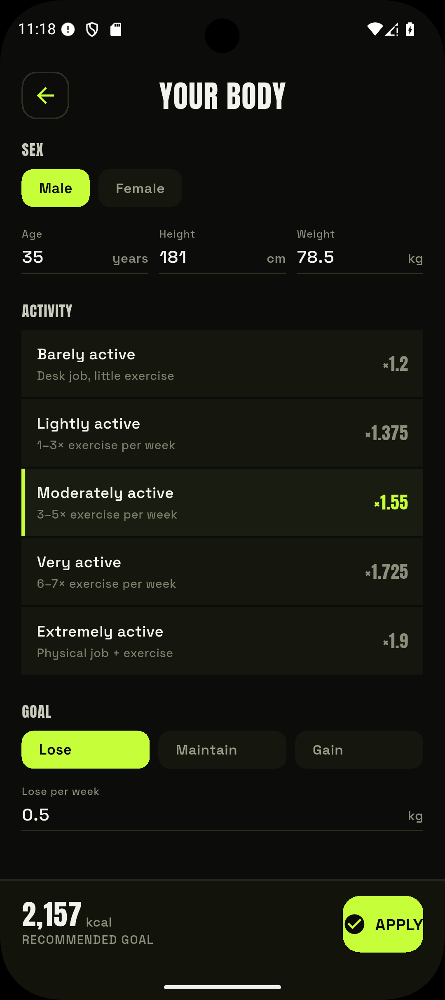

# Goals & TDEE

Under **Profile → Goals** is the one place to view and change all target values.

<figure markdown="span">
  { .screenshot }
  <figcaption>The calorie calculator (Mifflin-St Jeor) — reached via "Recalculate from body data".</figcaption>
</figure>

## The goals page

- **Daily calories** — your calorie target. Tap **Change** to open the calorie sheet: either
  set the value **manually** with ± steps, or choose **Recalculate from body data**, which
  leads to [your body data](#body-data-tdee).
- **Macro split** — the split across carbs, protein and fat.
- **Water goal** and **Glass size**.
- **Safety factor** — dampens estimated activity calories (see [Diary](tagebuch.md)).

## Body data & TDEE

The calorie calculation uses the **Mifflin-St Jeor formula** for the basal metabolic rate
(BMR), multiplied by an **activity factor** for total expenditure (TDEE), then adjusts the
result to your goal (lose / maintain / gain).

Inputs: sex, age, height, weight and activity level. **Apply** saves and jumps back to the
goals page.

!!! info "Always overridable"
    The calculation is only a suggestion. The calorie goal can be set by hand anytime — the
    calculator is only reached via **Recalculate from body data**, and your manual value is
    never silently overwritten.

## Target history

EasyTrack remembers which goal applied from when. The [history](verlauf.md) compares each of
your days against the goal that was valid **then**, not just today's value.
